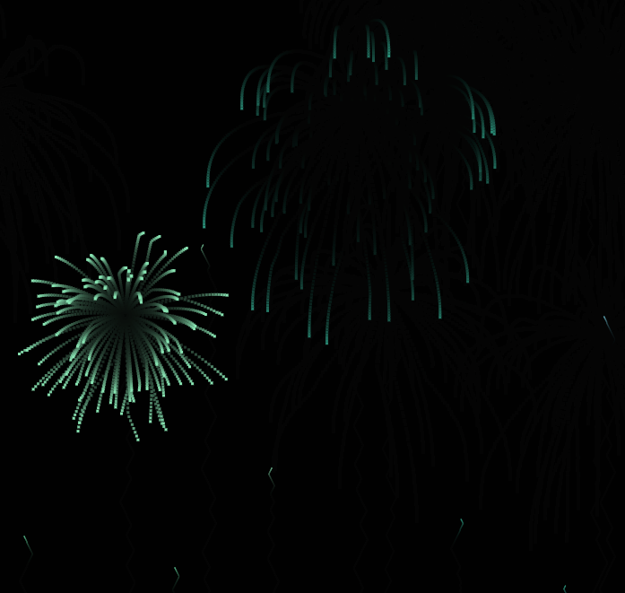
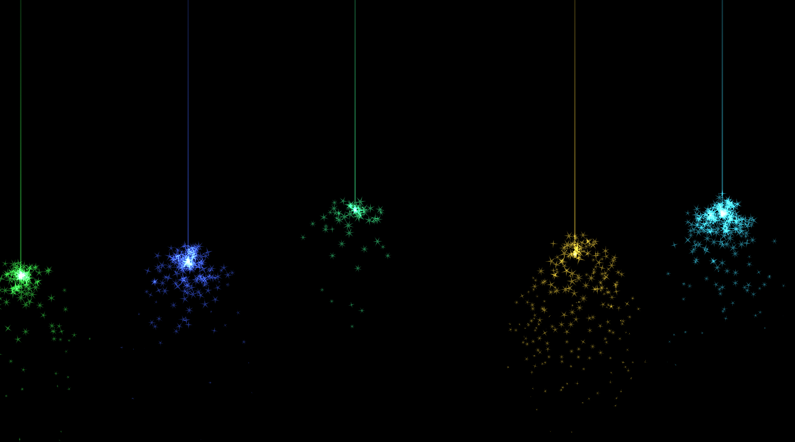

# KS-Live-Wallpaper-Core WorkShop Collection

## How to Use
1. Clone or download this repository to your local machine.
2. Click the DISCOVER option in KS-Live-Wallpaper-Core software to import html files, and Video to import video files.

3. The PNG images are preview thumbnails for the corresponding HTML visualizations.

### 3D Earth Simulation
- **HTML File**: [3DEarth.html](3DEarth.html)
- **Preview**: 

### Animated Clock Series
- **Clock 1**
  - HTML File: [Clock1.html](Clock1.html)
  - Preview: 
- **Clock 2** [Clock2.html](Clock2.html)
  - Preview: 
- **Clock 3** [Clock3.html](Clock3.html)
  - Preview: 

### Firework Animations
- **Firework 1**
  - HTML File: [firework1.html](firework1.html)
  - Preview: 
- **Firework 2**
  - HTML File: [firework2.html](firework2.html)
  - Preview: 
- **Firework 3**
  - HTML File: [firework3.html](firework3.html)
  - Preview: 
- **Firework 4**
  - HTML File: [firework4.html](firework4.html)
  - Preview: 

### Flower Visualizations
- **Flower 1**
  - HTML File: [flower1.html](flower1.html)
  - Preview: 
- **Flower 2**
  - HTML File: [flower2.html](flower2.html)
  - Preview: 
- **Flower 3**
  - HTML File: [flower3.html](flower3.html)
  - Preview: 
- **Flower 4** (Only HTML file, no preview image)
  - HTML File: [flower4.html](flower4.html)

### Galaxy Visualizations
- **Galaxy 1**
  - HTML File: [galaxy1.html](galaxy1.html)
  - Preview: 
- **Galaxy 2**
  - HTML File: [galaxy2.html](galaxy2.html)
  - Preview: 
- **Galaxy 3**
  - HTML File: [galaxy3.html](galaxy3.html)
  - Preview: 

## Notes
- Some entries have only HTML files (no PNG) or only PNG files (no HTML) as indicated.
- All HTML files are standalone and do not require additional dependencies to run.
